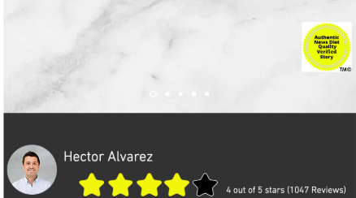

# The News Diet
## About
The main objective was to create a news service that increased news comprehension and understanding, while also delivering reliable information to the public. 

## Goals of our Site
For our site to create a news serivce that increased news comprehension and understanding, while also delivering reliable information to the public we felt the website should contain the following:
- Small chunks reading mechanism
- Story summarization
- Sterilization of writing language and tone
- Author ratings
- Public feedback
- Strict fact reporting seperated from opinion
- Story verification/ quality seal
- Author history
- Easily accessible citations
---------------------------------------
## First Prototype

Prototype Capabilities:
- Show name of site and logo
- Show news categories
- Showcase featured stories
- Show title of story and story summary
- Show article Author and rating
- Show quality seal for articles which have been authorized
## User Testing
### Methodology: Open ended testing forum
- Users were given product and time to use it
- After the 15 minute period we asked subjects what their thoughts were
- We also asked directed questions:
- What improvements needed to be made?
- How was the reading experience?
- How easy was navigation?
- Were you confused by any aspect of the site?
- Did you understand the rating system?
- Were you able to find all the respective sections?

|Main things we learned   |Graph Results   |
|---|---|
|1. The news section should be longer 2. More consistent writing sytles between pages. 3. The author history section should be clearly labeled. 4. Page navigation should be easier.  5. Prefer a star rating system rather than thumbs up or down.   |   |

---------------------------------------
## Final Prototype
|   |   |
|---|---|
### Main Functions:
- Uses simple arrows to facilitate reading progession.
- Contains a quality seal at the bottom of the screen on each page.
- Progresses the user from summary, to transcript, to minimal analysis, to opinion section, to story rating.
- Uses an intuitive star rating system.
- Also contains a section that users can use to comment on the story and add public feedback.
- Site contains a section to select different news categories.
- There is also a featured stories section that shows off popular stories.
## Final Testing
### Methodology: Open ended testing forum
Users were given product and time to use it. After the 15 minute period we asked subjects what their thoughts were. We also asked directed questions:
- What did you think about the links in the opinion section?
- Did you like the news categories?
- Would you actually read the featured stories?
- Did you feel that the design of the page was overwhelming?
- What did you think about the colors of the page?
- Do you believe the page looked professional?
- What improvements need to be made?
- How was the reading experience?
- How easy was navigation?
- Were you confused by any aspect of the site?
- Did you understand the rating system?
- Were you able to find all the respective sections?

| Main things we learned  | Graph Results   |
|---|---|
|Postive feedback to the updated star rating system. Needs better navigation from short summary to full article. Story layout could be better (addition of images). Hard to find navigation buttons for next section. Didn't want to read all the sections.   |   |